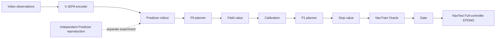

# RISE: Adaptive Imagination for World Action Models

[English](README.md) | [简体中文](README_zh-CN.md)

[](LICENSE)


RISE is a research implementation of adaptive latent imagination for video-based autonomous-driving trajectory
prediction, built around a V-JEPA-style encoder, predictor, and multi-modal planner.

> **Release status:** this repository currently publishes code and configuration only. Model weights, Counterfactual
> data, the paper, and numerical results are not released. The paper and results are forthcoming.

## Overview

The public surface contains the code-supported pieces needed to inspect and reproduce the retained NavSim workflow:

- seven full, flat training YAML files with strict path and lineage validation;
- an independent reproduction of the Predictor configuration;
- the manually operated controller chain `P0 -> Field -> Calibration -> P1 -> Stop -> Oracle -> Gate`;
- Counterfactual trajectory-quality sidecar generation and input-fingerprint checks;
- five explicit NavTrain Oracle scoring actions, one for each horizon from H0 through H4;
- one maintained final evaluation: NavTest Full-controller EPDMS at H=4 through the official one-stage scorer.

No workflow engine is included. Training, checkpoint selection, Oracle scoring, and evaluation remain explicit operator
actions.



The Predictor YAML belongs to the seven-config release, but its output is not a handoff into P0. The controller is the
separate manual chain shown above.

## Release scope

This is a code and configuration only release. It includes training and evaluation implementations, strict public
configuration contracts, no-data structural tests, and manual reproduction instructions. It does not include:

- trained weights or private checkpoints;
- NavSim, NuPlan, sensor, map, or metric-cache assets;
- Counterfactual PKL data, pose overlays, or annotations;
- generated sidecars, manifests, Oracle databases, or score outputs;
- the forthcoming paper or numerical results.

You must provide all external assets and replace every `/path/to/` value before production execution. Missing or
unedited paths fail fast; the code does not search for private or substitute assets.

## Quick start

RISE requires Python 3.11 or newer. From a repository checkout:

```bash
cd /path/to/rise
python3 -m pip install -e .
export PYTHONPATH="$(pwd):${PYTHONPATH:-}"
```

Cold-import and CPU/no-data checks do not require NavSim assets or a GPU:

```bash
python3 -c "import app.vjepa_cowa_world_model; import src"
python3 tools/run_cvoi_manual_oracle.py --help
python3 tools/run_cvoi_direct_epdms.py --help
python3 -m pytest -q tests/test_cvoi_manual_full_configs.py tests/test_cvoi_direct_epdms_config.py
```

These checks validate software and configuration structure only. They do not constitute training, Oracle scoring, or
EPDMS scoring.

## Installation and environment boundaries

Editable installation is the supported development setup. Actual training requires a compatible PyTorch/CUDA stack,
sufficient GPU memory, and the external inputs declared by the chosen YAML. Actual EPDMS evaluation additionally
requires the official NavSim devkit, NuPlan maps, a metric cache, and its Python environment.

The repository does not silently downgrade GPU work to CPU, discover alternate checkpoints, or infer missing paths.
See [Configuration](docs/configuration.md) before launching a data-dependent command.

## Data and checkpoints

The configurations use neutral absolute examples under `/path/to/` for user-owned assets and results. Repository-owned
scene filters and the EPDMS P1 training configuration remain repository-relative. Required external inputs include:

- NavSim trainval/test logs and sensor blobs;
- official scene filters, maps, devkit, and metric cache;
- Counterfactual logs, sensor blobs, pose overlays, and locked annotations;
- a compatible encoder/world-model checkpoint and its parameter file;
- writable, separately selected Full, ablation, and EPDMS result roots.

Weights and Counterfactual data are not released. Consult the upstream data and devkit terms before obtaining or using
third-party assets.

## Training and evaluation

Use the [English reproduction guide](docs/reproduction.md) or the
[Chinese reproduction guide](docs/reproduction_zh-CN.md) for the exact manual commands. The configuration directories
also provide concise indexes:

- [seven-stage training configurations](configs/train/navsim/cvoi_manual_full/README.md);
- [Full-controller EPDMS configuration](configs/eval/navsim/cvoi_manual_epdms/README.md).

The final maintained evaluation path is NavTest Full-controller EPDMS at H=4. The controller selects among H0 through
H4 online; the public EPDMS CLI does not expose a forced horizon option.

## Repository layout

```text
app/vjepa_cowa_world_model/   training, planning, and evaluation application
src/                          retained V-JEPA model and shared utilities
configs/train/navsim/         seven flat manual-chain training configurations
configs/eval/navsim/          one public Full-controller EPDMS configuration
tools/                        sidecar, Oracle, and direct EPDMS command-line tools
scripts/eval_navsim/          official one-stage scorer boundary
tests/                        structural, unit, and public-surface checks
docs/                         reproduction and configuration guides
```

## Results

Numerical results are not released. They will be published with the forthcoming paper; this repository makes no
benchmark or performance claim without released evidence.

## Limitations and responsible use

RISE is research software. It has not been validated for safety-critical deployment
and is not approved for direct real-vehicle control. Users are responsible for dataset licenses, privacy, evaluation
integrity, environment safety, and independent verification of any derived system. Real training, Oracle scoring, and
EPDMS scoring are not claimed as completed by this release.

## Citation, community, and security

The paper citation is not yet available. Software citation metadata will be published in [CITATION.cff](CITATION.cff)
as part of the public governance surface; do not infer a paper citation from the software record.

- Contributions: [CONTRIBUTING.md](CONTRIBUTING.md)
- Community conduct: [CODE_OF_CONDUCT.md](CODE_OF_CONDUCT.md)
- Security reporting: [SECURITY.md](SECURITY.md)
- Release history: [CHANGELOG.md](CHANGELOG.md)
- License: [LICENSE](LICENSE)
- Third-party notices: [THIRD_PARTY_NOTICES.md](THIRD_PARTY_NOTICES.md)

## Acknowledgements and support

RISE builds on the V-JEPA, NavSim, NuPlan, PyTorch, and wider open-source research ecosystems. Their software, data,
models, and trademarks remain subject to their respective terms. The trajectory-diffusion implementation is
independently written RISE code, with technical foundations in [DiT](https://arxiv.org/abs/2212.09748),
[Score-SDE](https://arxiv.org/abs/2011.13456), and [DPM-Solver++](https://arxiv.org/abs/2211.01095).
The RISE paper is not yet released. General support uses the public repository's issue tracker when available;
security reports must follow the private process in [SECURITY.md](SECURITY.md).
