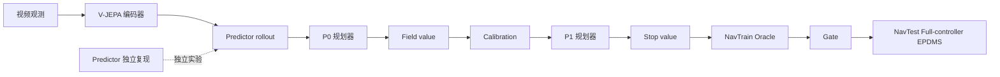

# RISE: Adaptive Imagination for World Action Models

[English](README.md) | [简体中文](README_zh-CN.md)

[](LICENSE)


RISE 是面向视频自动驾驶轨迹预测的自适应潜空间想象研究实现，由 V-JEPA 风格编码器、Predictor 与
多模态规划器组成。

> **发布状态：**当前版本仅包含代码与配置。模型权重、Counterfactual 数据、论文和数值结果均未发布；
> 论文发布时将同步公布结果。

## 概览

公开内容只覆盖代码能够支持和本地验证的 NavSim 复现表面：

- 七份完整、平铺的训练 YAML，以及严格的路径与 lineage 校验；
- 一份 Predictor 独立复现配置；
- 由操作者逐步执行的控制链 `P0 -> Field -> Calibration -> P1 -> Stop -> Oracle -> Gate`；
- Counterfactual trajectory-quality sidecar 生成与输入指纹校验；
- NavTrain Oracle 的五次独立评分操作，分别对应 H0 至 H4；
- 唯一保留的最终评测：H=4 的 NavTest Full-controller EPDMS，并使用官方 one-stage scorer。

仓库不包含工作流引擎。训练、候选选择、Oracle 评分与最终评测都必须由操作者显式发起。



Predictor YAML 属于七配置发布集合，但它的输出不会交接给 P0。控制器是上图所示的另一条手工链。

## 发布范围

这是仅包含代码与配置的发布，提供训练与评测实现、严格的公开配置契约、无需数据的结构测试，以及
手工复现说明。以下内容未发布：

- 已训练权重与私有 checkpoint；
- NavSim、NuPlan、sensor、地图与 metric cache 资产；
- Counterfactual PKL、pose overlay 与 annotation；
- 生成后的 sidecar、manifest、Oracle 数据库与评分输出；
- 尚未发布的论文和数值结果。

真实执行前必须自行准备外部资产，并替换全部 `/path/to/` 值。缺失或未编辑的路径会 fail-fast；代码
不会寻找私有路径或替代资产。

## 快速开始

RISE 需要 Python 3.11 或更高版本。从仓库 checkout 开始：

```bash
cd /path/to/rise
python3 -m pip install -e .
export PYTHONPATH="$(pwd):${PYTHONPATH:-}"
```

以下冷导入与 CPU/无数据检查不需要 NavSim 资产或 GPU：

```bash
python3 -c "import app.vjepa_cowa_world_model; import src"
python3 tools/run_cvoi_manual_oracle.py --help
python3 tools/run_cvoi_direct_epdms.py --help
python3 -m pytest -q tests/test_cvoi_manual_full_configs.py tests/test_cvoi_direct_epdms_config.py
```

这些命令只校验软件与配置结构，不代表已完成训练、Oracle 评分或 EPDMS 评分。

## 安装与环境边界

开发环境采用 editable install。真实训练还需要兼容的 PyTorch/CUDA 环境、足够的 GPU 显存，以及所选
YAML 声明的全部外部输入。真实 EPDMS 评测还需要官方 NavSim devkit、NuPlan 地图、metric cache 和
对应 Python 环境。

仓库不会把 GPU 工作静默降级到 CPU，也不会自动发现其他 checkpoint 或推断缺失路径。运行数据相关
命令前请先阅读[配置指南](docs/configuration.md)。

## 数据与 checkpoint

配置以 `/path/to/` 下的中性绝对路径表示用户资产和结果；仓库内 scene filter 与 EPDMS 的 P1 训练配置
保持仓库相对路径。外部输入包括：

- NavSim trainval/test 日志与 sensor blobs；
- 官方 scene filter、地图、devkit 与 metric cache；
- Counterfactual 日志、sensor blobs、pose overlay 与锁定 annotation；
- 兼容的编码器/世界模型 checkpoint 及其参数文件；
- 分别选择且可写的 Full、ablation 与 EPDMS 结果根目录。

权重与 Counterfactual 数据未发布。获取或使用第三方资产前，请自行确认上游许可条款。

## 训练与评测

精确的手工命令见[英文复现指南](docs/reproduction.md)与
[中文复现指南](docs/reproduction_zh-CN.md)。配置目录还提供两个简短索引：

- [七阶段训练配置](configs/train/navsim/cvoi_manual_full/README.md)；
- [Full-controller EPDMS 配置](configs/eval/navsim/cvoi_manual_epdms/README.md)。

唯一保留的最终评测是 H=4 的 NavTest Full-controller EPDMS。控制器在线选择 H0 至 H4；公开 EPDMS
CLI 不提供强制 horizon 参数。

## 仓库结构

```text
app/vjepa_cowa_world_model/   训练、规划与评测应用
src/                          保留的 V-JEPA 模型与共享工具
configs/train/navsim/         七份平铺的手工控制链训练配置
configs/eval/navsim/          一份公开 Full-controller EPDMS 配置
tools/                        sidecar、Oracle 与 direct EPDMS 命令行工具
scripts/eval_navsim/          官方 one-stage scorer 边界
tests/                        结构、单元与公开表面测试
docs/                         复现与配置指南
```

## 结果

数值结果未发布。结果将在论文发布时公开；在证据发布前，本仓库不作 benchmark 或性能声明。

## 局限与负责任使用

RISE 是研究软件，尚未经过安全关键部署验证，不适用于真实车辆直接控制。使用者需自行负责数据许可、
隐私、评测完整性、运行环境安全，以及对衍生系统的独立验证。本版本不声称已完成真实训练、Oracle 评分
或 EPDMS 评分。

## 引用、社区与安全

论文引用信息尚未发布。软件引用元数据将在公开治理表面中的 [CITATION.cff](CITATION.cff) 提供；请勿
将软件记录推断为论文引用。

- 贡献指南：[CONTRIBUTING.md](CONTRIBUTING.md)
- 社区行为准则：[CODE_OF_CONDUCT.md](CODE_OF_CONDUCT.md)
- 安全报告：[SECURITY.md](SECURITY.md)
- 版本历史：[CHANGELOG.md](CHANGELOG.md)
- 软件许可：[LICENSE](LICENSE)
- 第三方声明：[THIRD_PARTY_NOTICES.md](THIRD_PARTY_NOTICES.md)

## 致谢与支持

RISE 基于 V-JEPA、NavSim、NuPlan、PyTorch 及更广泛的开源研究生态。相关软件、数据、模型与商标仍受
各自条款约束。RISE 的轨迹扩散实现为独立编写的代码，其技术基础来自
[DiT](https://arxiv.org/abs/2212.09748)、[Score-SDE](https://arxiv.org/abs/2011.13456) 与
[DPM-Solver++](https://arxiv.org/abs/2211.01095)。
RISE 论文尚未发布。公开仓库可用时，一般支持使用其 issue tracker；安全问题必须遵循
[SECURITY.md](SECURITY.md) 中的私密流程。
